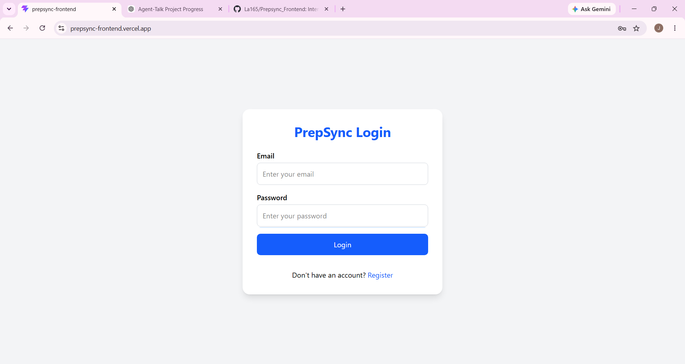
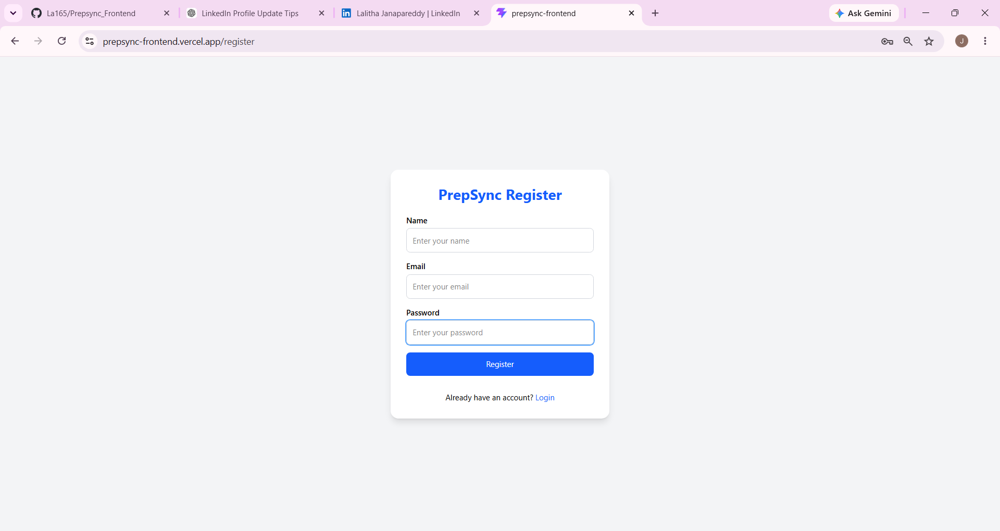
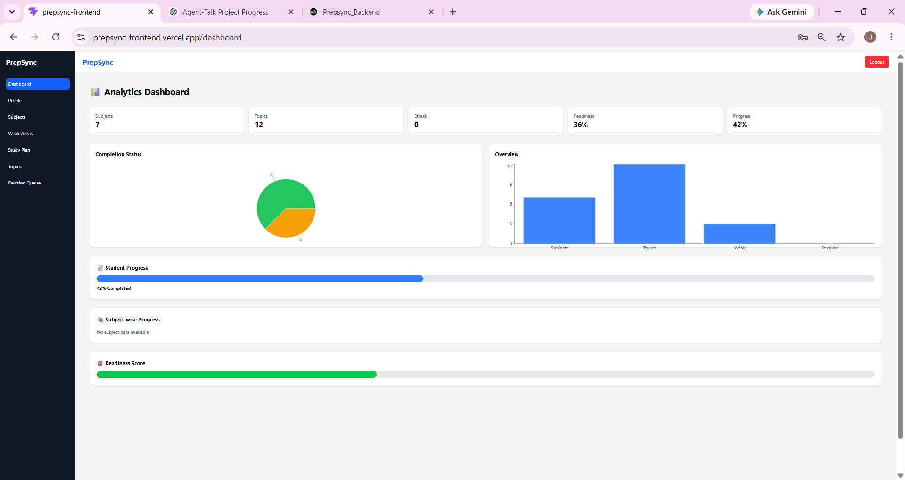
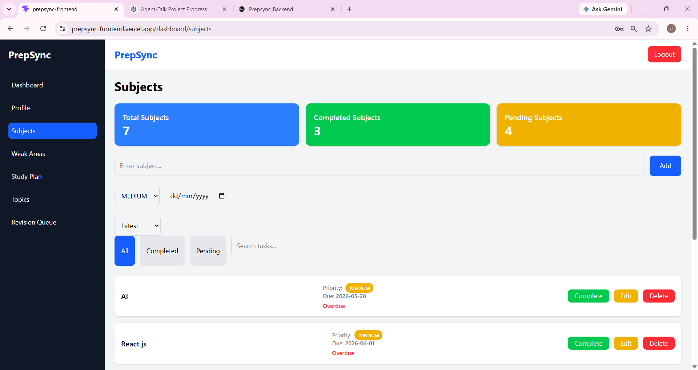
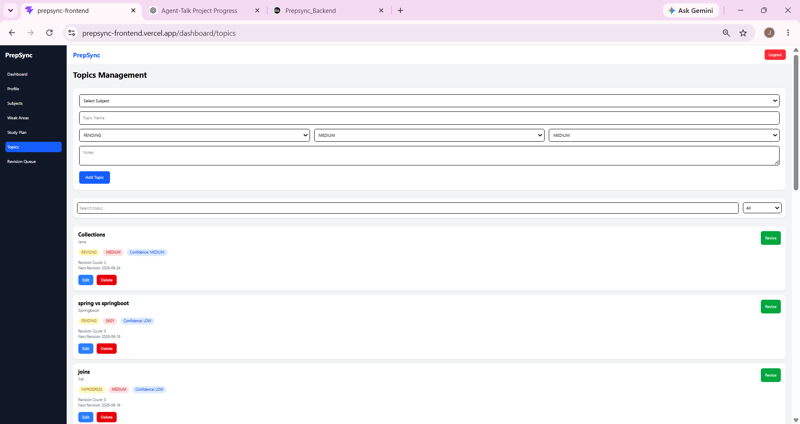
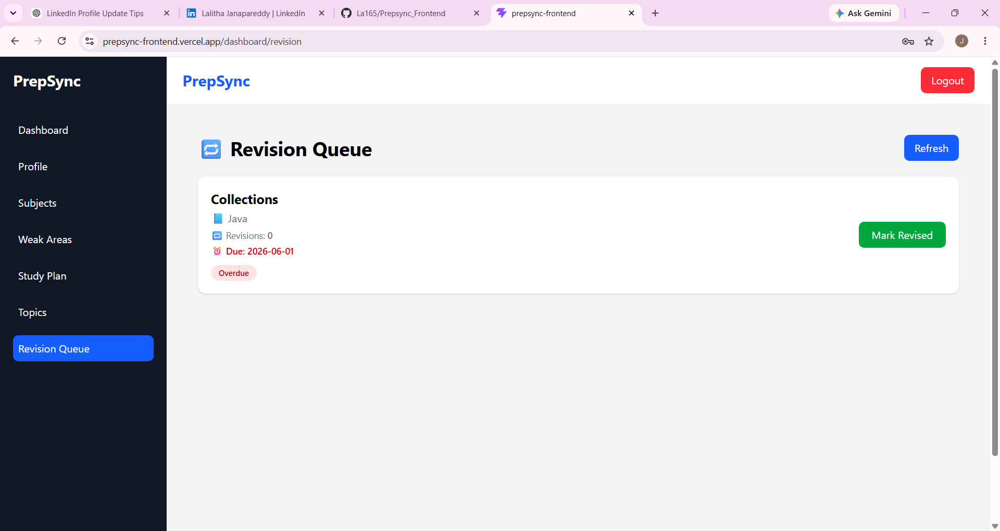
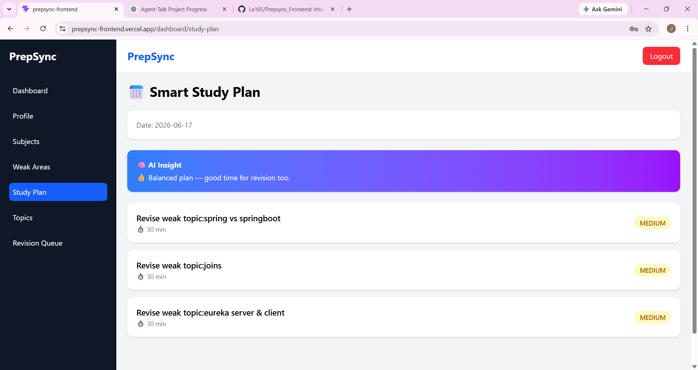
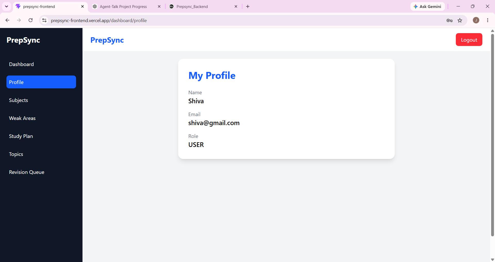

# 🚀 PrepSync Frontend

PrepSync is a smart learning tracker web application designed to help students efficiently manage subjects, track learning progress, identify weak areas, and maintain a consistent revision schedule.

The application provides an interactive dashboard, topic tracking, revision reminders, study planning, and progress analytics to help learners prepare effectively.

## 🌐 Live Demo

👉 https://prepsync-frontend.vercel.app/

## 🔗 Backend API

👉 https://prepsyncbackend-production.up.railway.app/

---

## ✨ Features

* 🔐 User Authentication (Login / Register)
* 🧭 Protected Routes using JWT Authentication
* 📊 Interactive Analytics Dashboard
* 📚 Subject Management
* 📝 Topic Tracking & Progress Monitoring
* ⚠️ Weak Areas Identification
* 🧠 Study Plan Management
* 🔁 Revision Queue & Spaced Repetition Tracking
* 📈 Progress Visualization using Charts
* 📱 Responsive User Interface

---

## 🛠 Tech Stack

| Technology       | Purpose            |
| ---------------- | ------------------ |
| React 18         | Frontend Framework |
| Vite             | Build Tool         |
| Tailwind CSS     | UI Styling         |
| React Router DOM | Routing            |
| Axios            | API Communication  |
| Recharts         | Data Visualization |
| React Hot Toast  | Notifications      |
| Lucide React     | Icons              |

---

## 📸 Application Screenshots

### 🔐 Login



### 📝 Register



### 📊 Dashboard



### 📚 Subjects Management



### 📝 Topics Management



### 🔁 Revision Queue



### ⚠️ Weak Areas


### 🧠 Study Plan



### 👤 Profile



---

## 🏗️ Frontend Architecture

```text
src/
│
├── components/      Reusable UI Components
├── pages/           Application Pages
├── services/        API Service Layer
├── routes/          Protected Routes
├── api/             Axios Configuration
├── App.jsx          Route Configuration
└── main.jsx         Application Entry Point
```

---

## ⚙️ Installation & Setup

### Clone Repository

```bash
git clone https://github.com/La165/Prepsync_Frontend.git
cd Prepsync_Frontend
```

### Install Dependencies

```bash
npm install
```

### Configure Environment Variables

Create a `.env` file in the project root:

```env
VITE_API_URL=https://your-backend-url
```

### Run Application

```bash
npm run dev
```

Application runs at:

```text
http://localhost:5173
```

---

## 🔐 Authentication Flow

1. User registers or logs in
2. Backend validates credentials
3. JWT token is generated
4. Token is stored in localStorage
5. Axios interceptor attaches token automatically
6. Protected routes restrict unauthorized access

---

## 🚀 Production Build

```bash
npm run build
```

Output directory:

```text
dist/
```

---

## ☁️ Deployment

### Frontend Hosting

* Vercel

### Backend Hosting

* Railway

### Database

* MySQL

---

## 🎯 Key Highlights

* Modern React 18 Architecture
* Secure JWT Authentication
* API Driven Design
* Reusable Component Structure
* Responsive UI
* Data Visualization Dashboard
* Production Ready Deployment

---

## 👩‍💻 Author

**Lalitha**

GitHub: https://github.com/La165
